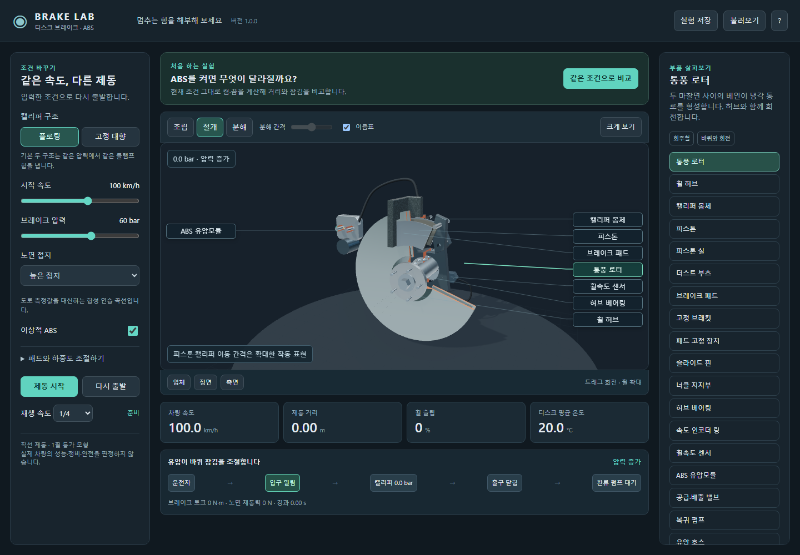
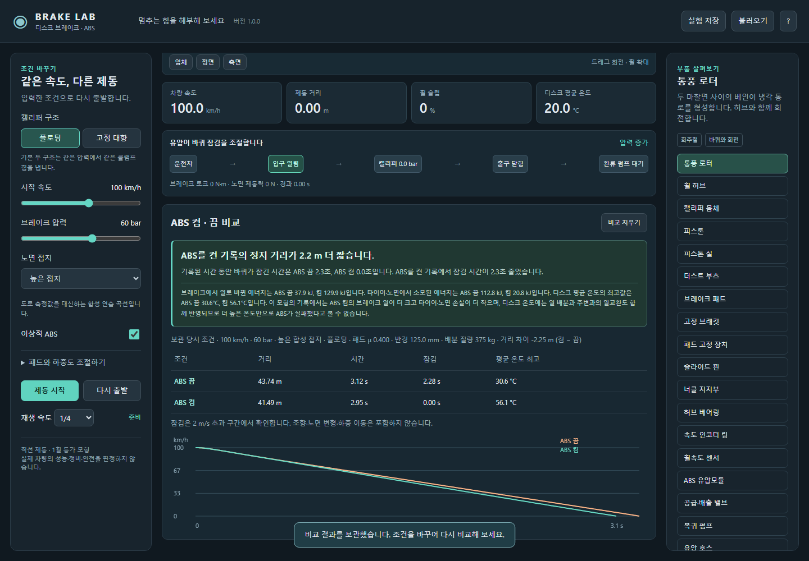

# Brake Lab

**Brake Lab 1.0.0**은 브레이크 구조와 ABS의 작동을 직접 살펴보고, 조건을 바꾸어 제동 결과를 비교하는 **Windows x64용 오프라인 시뮬레이션 앱**입니다.

**[Windows 설치파일 다운로드](https://github.com/Ulsancl/brake-lab/releases/latest)**

릴리스에서 `Brake-Lab-Setup-1.0.0.exe`를 받아 실행하고 설치 위치를 선택하세요. 설치 후 바탕화면이나 시작 메뉴의 **Brake Lab** 아이콘으로 시작합니다. Node.js 설치나 별도 서버 실행이 필요 없으며, 계산과 3D 화면이 앱에 포함되어 인터넷 연결 없이 사용할 수 있습니다. 설치파일에는 코드 서명이 없습니다.

처음 비교를 실행하면 결과가 바로 보이도록 화면이 이동합니다. 저장된 결과를 바탕으로 더 짧은 거리·더 긴 거리·비슷한 거리·정지 미완료를 쉬운 문장으로 설명합니다. 처음부터 정지한 조건도 별도로 안내하며, 원래 조건과 상세 수치는 그대로 표시합니다.

결과를 읽은 뒤 제동 시작·이어서 제동을 누르면 3D 구조로 돌아와 움직임을 관찰합니다. 일시정지는 현재 화면과 재생 시점을 유지합니다.

크게 보기에서도 부품을 선택하고 역할·재질을 읽으며, 재생 속도와 압력을 조절합니다. 부품을 선택해도 시점은 유지되어 주변 구조와 함께 관찰할 수 있습니다. 속도·슬립·경과 시간도 함께 표시합니다. 비교 결과는 보관된 브레이크 열과 타이어·노면 손실을 읽고 온도 변화에 영향을 주는 열 배분·주변 열교환을 안내합니다.

플로팅·고정 대향 캘리퍼, 통풍 디스크·패드·피스톤·씰·베어링·센서와 외부 ABS 유압모듈을 직접 선택할 수 있습니다. 조립·절개·분해 보기, 크게 보기, 압력·접지·패드·하중 조절과 같은 조건의 이상적 ABS 켬·끔 비교를 구현했습니다. 비교 뒤 조건을 바꿔도 저장 당시의 결과가 유지됩니다.

설정과 실제 계산한 비교 결과를 JSON 실험 파일로 보관하고 복원합니다. 손상된 자동 저장은 원문을 먼저 보관하며, 더 새로운 형식의 자동 저장은 덮어쓰지 않습니다. 지원 범위 밖의 그림 치수는 대표 형상이라는 표시로 계산값과 구분합니다.

검사 범위에는 계산·형상·저장 형식·결과 설명과 실제 WebGL 화면의 절개·분해, 부품 선택, 시점 유지, 재생·일시정지, 파일 저장·불러오기가 포함됩니다. Windows 앱 검사에서는 메뉴·단축키·파일 작업 취소·단일 창·재시작 후 조건과 결과 복원을 다룹니다. 배포 검사에서는 설치파일과 실행 폴더의 파일, 앱·문서·라이선스의 일치를 대조합니다. **각 버전의 검증 결과와 확인 환경은 해당 릴리스 설명을 참고하세요.** 자동 검사만으로 모든 GPU의 성능이나 실사용 경험을 보장하지 않습니다.

[제품 범위와 품질 기준](docs/consumer-release.md)에서 관찰·실험·보관 경험의 평가 기준과 검증 범위를 설명합니다.

일반 사용자의 구조 관찰·체험·비교 실험을 위해 직선 제동과 한 바퀴의 등가 모형, 합성 노면 곡선, 이상적 ABS, 평균 디스크 온도를 사용합니다. 하중 이동·조향·실차 센서 보정·패드 페이드·오일 비등은 계산하지 않으며, 실제 차량의 성능·정비·안전을 판정하지 않습니다. 자체 형상을 만들며 제조사의 사진이나 CAD를 포함하지 않습니다.

기초 원리는 [Bosch ABS](https://www.bosch-mobility.com/en/solutions/driving-safety/antilock-braking-system/), [MathWorks 디스크 브레이크](https://www.mathworks.com/help/sdl/ref/discbrake.html), [타이어와 노면 모형](https://www.mathworks.com/help/sdl/ref/tireroadinteractionmagicformula.html)을 참고합니다. 구체적인 식·기본값·한계는 [계산 모형](docs/model.md)과 [부품 구조](docs/anatomy.md)에서 설명합니다.

앱 자체는 UNLICENSED입니다. Three.js·Electron과 포함 구성요소의 [외부 소프트웨어 고지](docs/THIRD-PARTY-NOTICES.md)는 별도로 제공합니다.
